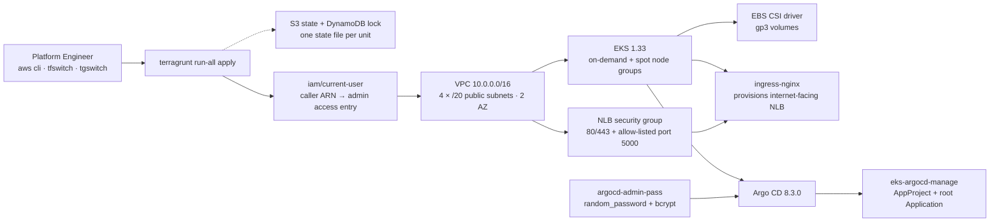
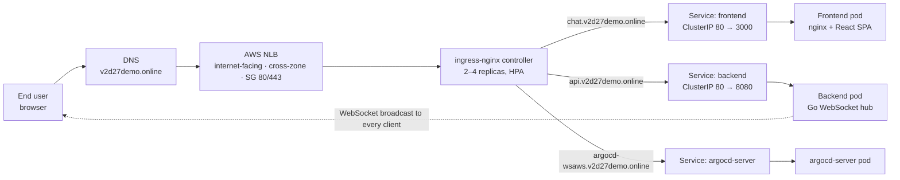

# AWS EKS — Real-Time Chat Platform

An end-to-end project that includes a Go WebSocket backend, a React + TypeScript frontend, and AWS infrastructure on EKS.
Infrastructure is managed with Terragrunt, while GitHub Actions, Docker Hub, and Argo CD provide automated GitOps deployment.
The entire platform can be rebuilt from code, and application changes are deployed automatically without manual kubectl operations.

## Architecture

### 1 · Infrastructure flow

Terragrunt provisions AWS bottom-up. Each unit is its own state file with explicit dependencies, so a change to the ingress controller plans against ingress state only.



### 2 · Deployment flow

CI builds the image and writes the new tag into Git. Argo CD does the deploying. CI has no kubeconfig and no AWS deploy role — its only privilege is write access to this repository, which makes every deploy a reviewable commit and every rollback a `git revert`.

```mermaid
flowchart LR
    DEV["Developer<br/>push to app/backend or app/frontend"] --> GHA["GitHub Actions<br/>cd-backend.yml / cd-frontend.yml → cd.yml"]
    GHA --> BX["docker buildx<br/>linux/amd64 + arm64, cached layers"]
    BX --> DH["Docker Hub<br/>tag: branch-sha"]
    DH --> KZ["kustomize edit set image<br/>manifest/services/SVC/overlays/ENV"]
    KZ --> BOT["Bot commit + push<br/>GitHub App token, rebase-retry"]
    BOT --> GIT["Git repository<br/>source of truth for cluster state"]
    GIT --> ACD["Argo CD<br/>ApplicationSets · auto-sync · prune · selfHeal"]
    ACD --> K8S["EKS<br/>rolling update"]
    DH -.->|kubelet pulls image| K8S
```



### 3 · User flow



## Repository layout

```text
aws-eks/
├── app/          # The chat application — Go backend + React frontend
├── infras/       # Terragrunt units and Terraform modules for AWS
├── manifest/     # Kustomize bases/overlays and Argo CD ApplicationSets
├── docs/         # Architecture diagram
└── .github/      # Build-and-commit workflows
```

Each folder has its own README with the detail:

- **[app/README.md](app/README.md)** — running the app, the WebSocket protocol, configuration
- **[infras/README.md](infras/README.md)** — the Terragrunt layout, what each unit provisions, how to apply it
- **[manifest/README.md](manifest/README.md)** — the GitOps model, base/overlay contract, CI-to-CD handoff

## Tech stack

| Area           | Tools                                                              |
| -------------- | ------------------------------------------------------------------ |
| Application    | Go 1.24 · gorilla/websocket · React 18 · TypeScript 5 · Vite 5     |
| Containers     | Docker multi-stage, multi-arch (amd64 + arm64), non-root, nginx    |
| Infrastructure | Terraform 1.12.2 · Terragrunt 0.82.4 · AWS EKS 1.33 · VPC · NLB    |
| In-cluster     | Helm (ingress-nginx, EBS CSI, Argo CD) · Kustomize · HPA · Ingress |
| Delivery       | Argo CD ApplicationSets · GitHub Actions · Docker Hub              |

## Decisions worth explaining

**One Terragrunt unit per component, not one big Terraform root.** Small blast radius, an explicit dependency graph that `run-all` can order, and configuration inherited once from `global_vars.hcl` / `region.hcl` / `env.hcl`. Adding an environment means copying a folder.

**Argo CD bootstraps itself, then Terraform steps out.** Terraform installs Argo CD and creates exactly one root Application. That Application applies three ApplicationSets, which discover everything else from the Git tree. After the bootstrap, Terraform is no longer in the application deployment path.

**Services are discovered by directory glob.** The service ApplicationSet generates Applications from `manifest/services/**/overlays/main`. A new service is a new folder — no Argo CD configuration to change, nothing to register.

**Autoscaling and GitOps are reconciled deliberately.** With `selfHeal: true`, Argo CD would keep reverting whatever the HPA scaled. The ApplicationSet declares `ignoreDifferences` on `/spec/replicas` so the two coexist.

**The image tag travels through Git.** CI never holds cluster credentials. It rewrites the `deployment-image` placeholder in the right overlay, commits as a bot, and the cluster pulls.

## Getting started

### Run the app locally

```bash
cd app
docker-compose up --build
# frontend  http://localhost:3000
# backend   http://localhost:8080/healthz
```

No AWS account needed. See [app/README.md](app/README.md) for the non-Docker path.

### Build the infrastructure

Pin the tool versions with [tgswitch](https://github.com/warrensbox/tgswitch) and [tfswitch](https://github.com/warrensbox/terraform-switcher):

```bash
curl -L https://raw.githubusercontent.com/warrensbox/tgswitch/release/install.sh | sudo bash
tgswitch 0.82.4

curl -L https://raw.githubusercontent.com/warrensbox/terraform-switcher/master/install.sh | sudo bash
tfswitch 1.12.2
```

Then set your account ID in `infras/account/account.hcl` and your domain in `infras/global_vars.hcl`, and apply:

```bash
cd infras/account/ap-southeast-1/develop
terragrunt run-all plan
terragrunt run-all apply

aws eks update-kubeconfig --region ap-southeast-1 --name wsaws-develop-eks
```

Full prerequisites and the first-apply checklist are in [infras/README.md](infras/README.md).

## Environments

| Environment | Branch    | Namespace      | Frontend                    | Backend                    |
| ----------- | --------- | -------------- | --------------------------- | -------------------------- |
| develop     | `develop` | `chat-develop` | `chat-dev.v2d27demo.online` | `api-dev.v2d27demo.online` |
| main        | `main`    | `chat-main`    | `chat.v2d27demo.online`     | `api.v2d27demo.online`     |

Argo CD is reachable at `argocd-wsaws.v2d27demo.online`.

## License

Apache License 2.0, see [LICENSE](LICENSE).
