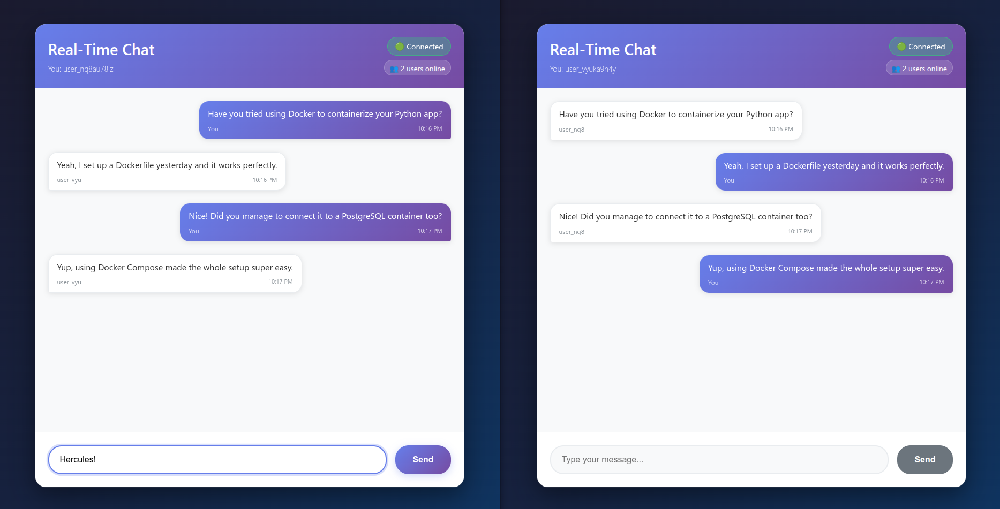

# Real-Time Chat Application

A simple real-time chat application built with Go backend and React frontend, featuring WebSocket communication.

## Core Features Summary:

- **Real-Time Messaging**: Instant communication using WebSocket with support for multiple clients.

- **Backend**: Manages connections, broadcasts messages, logs events, supports CORS, and offers health checks.

- **Frontend**: Modern UI with real-time updates, message history, connection indicators, keyboard shortcuts, and auto-scroll.

## Demo




## Project Structure
```
app/
├── backend/                 # Go WebSocket server
│   ├── cmd/server/         # Application entry point
│   ├── internal/           # Private application code
│   │   ├── handlers/       # HTTP request handlers
│   │   ├── models/         # Data structures
│   │   └── websocket/      # WebSocket logic
│   ├── pkg/config/         # Configuration management
│   └── main.go             # Main application file
├── frontend/               # React TypeScript frontend
│   ├── src/
│   │   ├── components/     # React components
│   │   ├── hooks/          # Custom hooks
│   │   ├── services/       # API services
│   │   ├── styles/         # CSS files
│   │   └── types.ts        # TypeScript definitions
│   ├── package.json
│   └── vite.config.ts
├── docker-compose.yml      # Multi-container setup
├── DEV_SETUP.md           # Development guide
└── DOCKER_README.md       # Docker guide
```


## Quick Start

### Prerequisites
- Go 1.21 or later
- Node.js 22.16 or later
- Docker and Docker Compose (optional)

### Development Setup

1. **Clone and navigate to the project:**
   ```bash
   cd aws-eks/app
   ```

2. **Backend Setup:**
   ```bash
   cd backend
   cp .env.example .env
   go mod tidy
   go run main.go
   ```

3. **Frontend Setup (in new terminal):**
   ```bash
   cd frontend  
   cp .env.example .env
   yarn install
   yarn run dev
   ```

4. **Access the application:**
   - Frontend: http://localhost:3000
   - Backend API: http://localhost:8080
   - WebSocket: ws://localhost:8080/ws

### Docker Setup (Alternative)

```bash
# Build and start all services
docker-compose up --build

# Run in background
docker-compose up -d --build
```

For detailed setup instructions, see [Documentation](#documentation)


## Documentation

- [Development Setup Guide](./docs/DEV_SETUP.md) - Detailed development environment setup
- [Docker Guide](./docs/DOCKER_README.md) - Docker and containerization instructions
- [Frontend README](frontend/README.md) - Frontend-specific documentation
- [Backend README](backend/README.md) - Backend-specific documentation

## Contributing

- All contributings are welcome!

## License

- Apache License 2.0, see [LICENSE](./LICENSE).