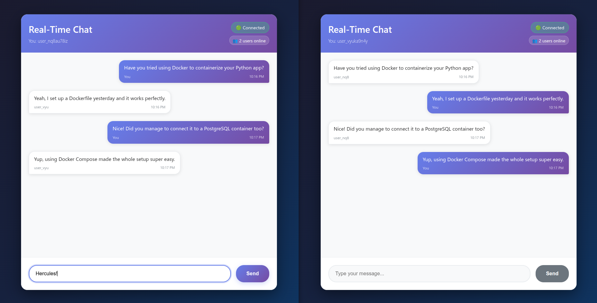

# Real-Time Chat Application

The application workload deployed by this repository — a real-time chat app with a Go WebSocket backend and a React + TypeScript frontend. Both services are containerized, published to Docker Hub by GitHub Actions, and rolled out to EKS by Argo CD.

## Demo



Live environment: `chat.v2d27demo.online` (frontend) and `api.v2d27demo.online` (backend).

## What it does

- **Real-time messaging** — clients connect over WebSocket; the backend hub broadcasts each message to every connected client.
- **Presence tracking** — the hub keeps a registry of connected users and pushes an updated client count and online-user list on every join and disconnect.
- **Health endpoints** — both services expose `/healthz`, used by the Docker healthchecks and by the Kubernetes liveness/readiness probes.
- **Config via environment** — no hardcoded hosts, so the same image runs locally, under Docker Compose, and in EKS.

## Structure

```
app/
├── backend/                  # Go WebSocket server
│   ├── cmd/server/           # Entry point (what the Dockerfile builds)
│   ├── internal/
│   │   ├── handlers/         # WebSocket upgrade + health handlers
│   │   ├── models/           # Message / ClientInfo / UserJoin types
│   │   └── websocket/        # Hub and client connection lifecycle
│   ├── pkg/config/           # Env-var configuration loader
│   ├── main.go               # Original single-file prototype, kept for reference
│   └── Dockerfile            # Multi-stage build → Alpine runtime, non-root user
├── frontend/                 # React + TypeScript, built with Vite
│   ├── src/
│   │   ├── hooks/            # useWebSocket — connection state and message handling
│   │   ├── services/         # WebSocket client wrapper
│   │   ├── styles/           # App CSS
│   │   ├── utils/            # Runtime config read from VITE_* vars
│   │   ├── App.tsx           # Main component
│   │   └── types.ts          # Shared message types
│   ├── nginx.conf            # Serves the SPA on :3000, adds /healthz, gzip, asset caching
│   └── Dockerfile            # Build with Node 22 → serve with nginx:alpine, non-root user
├── docs/                     # Setup guides and screenshots
└── docker-compose.yml        # Both services with healthchecks on a shared bridge network
```

## Tech stack

| Layer    | Choices                                                             |
| -------- | ------------------------------------------------------------------- |
| Backend  | Go 1.21+ (built on 1.24), gorilla/websocket, rs/cors, godotenv      |
| Frontend | React 18, TypeScript 5, Vite 5, native WebSocket API, Node 22.16+   |
| Runtime  | Docker multi-stage builds, non-root users, nginx for static serving |

## Quick start

### Prerequisites

- Go 1.21 or later
- Node.js 22.16 or later
- Docker and Docker Compose (optional)

### Local development

```bash
# Backend — http://localhost:8080
cd backend
cp .env.example .env
go mod tidy
go run ./cmd/server

# Frontend — http://localhost:3000 (new terminal)
cd frontend
cp .env.example .env
yarn install
yarn dev
```

Endpoints once running:

- Frontend: http://localhost:3000
- Health check: http://localhost:8080/healthz
- WebSocket: ws://localhost:8080/ws

### Docker Compose

```bash
docker-compose up --build      # foreground
docker-compose up -d --build   # detached
```

The frontend container waits for the backend healthcheck to pass before starting.

## Configuration

**Backend**

| Variable         | Description         | Default                 |
| ---------------- | ------------------- | ----------------------- |
| `HOST`           | Bind address        | `0.0.0.0`               |
| `PORT`           | HTTP port           | `8080`                  |
| `ALLOWED_ORIGIN` | CORS allowed origin | `http://localhost:3000` |
| `ENV`            | Environment mode    | `development`           |

**Frontend** — Vite requires the `VITE_` prefix, and the values are baked in at build time (the Dockerfile takes them as build args).

| Variable            | Description        | Default                 |
| ------------------- | ------------------ | ----------------------- |
| `VITE_WS_HOST`      | WebSocket host     | `localhost`             |
| `VITE_WS_PORT`      | WebSocket port     | `8080`                  |
| `VITE_WS_PROTOCOL`  | `ws` or `wss`      | `ws`                    |
| `VITE_API_BASE_URL` | API base URL       | `http://localhost:8080` |
| `VITE_APP_NAME`     | Displayed app name | `Chat Application`      |
| `VITE_DEBUG`        | Debug logging      | `true`                  |

## WebSocket protocol

Client → server:

```json
{ "type": "user_join", "userId": "user_abc123" }
{ "type": "message", "content": "Hello!", "senderId": "user_abc123" }
```

Server → all clients:

```json
{ "type": "message", "content": "Hello!", "senderId": "user_abc123", "timestamp": "2025-08-04T14:30:00Z" }
{ "type": "client_info", "totalClients": 3, "onlineUsers": ["user_abc123", "user_def456"] }
```

The server fills in `timestamp` when the client omits it.

## Testing

```bash
# Health check
curl http://localhost:8080/healthz

# WebSocket (npm install -g wscat)
wscat -c ws://localhost:8080/ws
> {"type":"user_join","userId":"test_user"}
> {"type":"message","content":"Hello from test!","senderId":"test_user"}
```

For a manual end-to-end check, open the frontend in two browser tabs and send a message from either one.

## How this gets deployed

A push to `app/backend/**` or `app/frontend/**` triggers the workflows in [.github/workflows/](../.github/workflows/), which build a multi-arch image, push it to Docker Hub, and commit the new tag into the matching Kustomize overlay under [manifest/services/](../manifest/services/). Argo CD picks up that commit and syncs the cluster. See [manifest/README.md](../manifest/README.md) for the GitOps side and [infras/README.md](../infras/README.md) for the cluster itself.

## Documentation

- [Development Setup Guide](./docs/DEV_SETUP.md)
- [Docker Guide](./docs/DOCKER_README.md)
- [Backend README](./backend/README.md)
- [Frontend README](./frontend/README.md)

## Contributing

All contributions are welcome.

## License

Apache License 2.0, see [LICENSE](./LICENSE).
